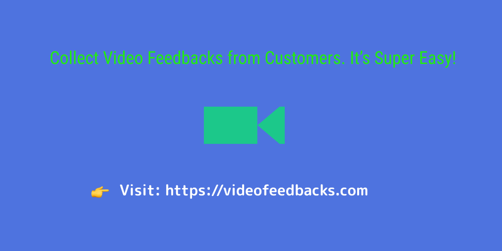
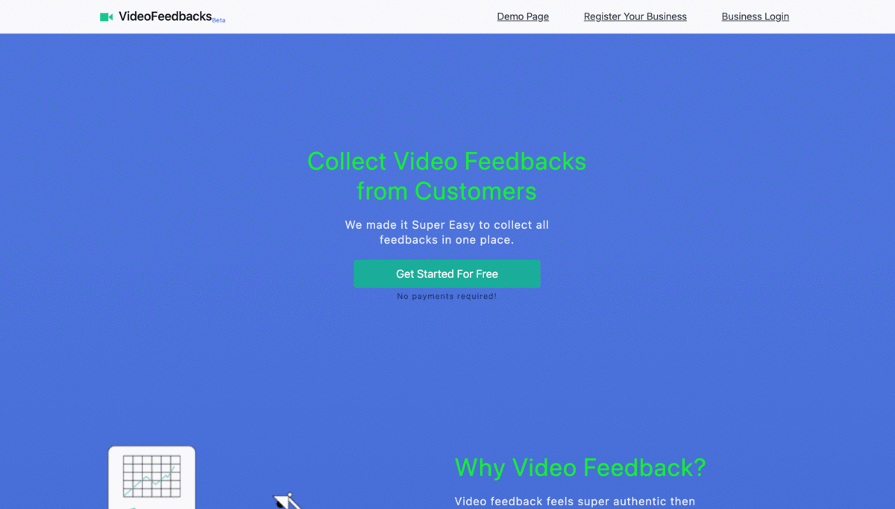

## About

VideoFeedbacks.com is a simple tool to collect video feedback as well as text feedback from customers. The user can set up a business page to collect feedback. A customer can record video from a mobile device or laptop or tablet device and send it to the business owner.

Who will get benefit from this product? A business or individual providing some service can use VideoFeedbacks.com to get video feedbacks from their customers.

## Features
1. Unlimited Video Feedbacks
2. Unlimited text feedbacks
3. Download All Feedbacks

Visit [VideoFeedbacks.com](https://videofeedbacks.com)

If you are a business owner or an individual providing some services and would like to get video feedback from customers. Please sign up [here](https://videofeedbacks.com/account/signup).

Thank you reading!

